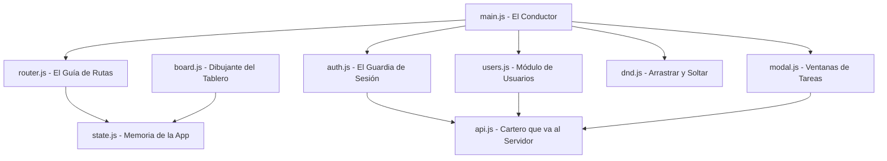

# Guía de Estudio de JavaScript: Riwiflow 🚀

¡Hola! Esta guía ha sido creada especialmente para ti, asumiendo que estás comenzando desde cero en JavaScript. Aquí encontrarás una explicación detallada de cada concepto básico que usa esta aplicación, seguido de un análisis archivo por archivo de cómo funciona todo el sistema.

---

## 🎯 PARTE 1: Conceptos Fundamentales de JavaScript

Para entender el código de Riwiflow, primero debemos familiarizarnos con las herramientas y reglas básicas de JavaScript (JS).

### 1. ¿Cómo se guarda la información? (Variables)
En JS, usamos variables para almacenar datos. Existen tres formas principales de declararlas:
*   `const`: Para valores que **no van a cambiar** (constantes). Ejemplo: un enlace de API.
*   `let`: Para valores que **sí pueden cambiar** en el tiempo. Ejemplo: el ID del usuario arrastrado.
*   `var`: Es la forma antigua y ya no se recomienda porque puede causar comportamientos confusos.

### 2. Estructuras de Datos de JS
*   **Strings (Textos)**: Se escriben entre comillas simples `'...',` dobles `"..."` o invertidas `` `...` ``.
*   **Numbers (Números)**: Ejemplo: `3001` o `12`.
*   **Booleans (Booleanos)**: Solo tienen dos estados: `true` (verdadero) o `false` (falso).
*   **Objects (Objetos)**: Guardan información agrupada en pares "clave: valor" dentro de llaves `{}`.
    ```javascript
    const usuario = {
      name: "Carlos Coder",
      role: "coder",
      id: 2
    };
    ```
    Puedes acceder a sus datos usando un punto: `usuario.name` te dará `"Carlos Coder"`.
*   **Arrays (Arreglos/Listas)**: Colecciones de datos ordenados dentro de corchetes `[]`.
    ```javascript
    const numeros = [10, 20, 30];
    ```

### 3. Funciones: Bloques de Código Reutilizables
Una función es como una máquina: le das entradas (parámetros), hace un proceso y da una salida.
*   **Función tradicional**:
    ```javascript
    function saludar(nombre) {
      return "Hola " + nombre;
    }
    ```
*   **Función Flecha (Arrow Functions)**: Es una forma más moderna y corta de escribir funciones usando `=>`.
    ```javascript
    const saludar = (nombre) => "Hola " + nombre;
    ```

### 4. Métodos para Manipular Listas (Arrays)
En Riwiflow verás métodos especiales que se aplican a los arreglos:
*   `.map(elemento => ...)`: Recorre una lista y transforma cada elemento en otra cosa, devolviendo una nueva lista. Se usa mucho para transformar datos en HTML visible.
*   `.filter(elemento => ...)`: Crea una nueva lista dejando únicamente los elementos que cumplan una condición. Por ejemplo, filtrar las tareas que correspondan a la columna "To Do".
*   `.find(elemento => ...)`: Busca dentro de la lista y te devuelve el **primer** elemento que coincida con la condición. Por ejemplo, buscar el usuario con ID `2`.

### 5. El DOM: La conexión de JS con tu HTML
El **DOM (Document Object Model)** es la representación que tiene el navegador de tu página HTML. JS usa el DOM para cambiar textos, colores o responder a clics:
*   `document.getElementById('id')`: Busca una etiqueta HTML usando su atributo `id`.
*   `elemento.classList.add('clase')` / `.remove('clase')` / `.toggle('clase')`: Modifica las clases de CSS del elemento para ocultarlo (por ejemplo, con `hidden`), mostrarlo o cambiar su estilo.
*   `addEventListener('evento', funcion)`: Le dice a JS que se quede "escuchando" un evento (como un clic o cuando el usuario escribe en un input) y ejecute una función cuando ocurra.
*   `e.preventDefault()`: Detiene la acción por defecto del navegador. Por ejemplo, evita que al enviar un formulario se recargue la página.

### 6. Event Delegation (Delegación de Eventos)
En lugar de poner un escuchador de eventos a cada botón (lo cual ralentiza la página), le ponemos un único escuchador al elemento padre (como `document`). Cuando se hace clic, usamos `e.target.closest('[atributo]')` para saber si el clic ocurrió dentro de un botón que nos interesa.

### 7. JSON y LocalStorage
*   **LocalStorage**: Es una pequeña base de datos dentro de tu navegador que guarda textos incluso si cierras la pestaña.
*   **JSON.stringify()**: Convierte un objeto de JS en texto, ya que LocalStorage solo acepta texto.
*   **JSON.parse()**: Convierte el texto guardado de vuelta en un objeto JS utilizable.

### 8. Código Asíncrono (Promises, async / await, fetch)
Cuando JS le pide información a un servidor en internet (una API), esto toma tiempo. Para evitar que la página se congele, JS usa la asincronía:
*   `fetch('url')`: Es como enviar una carta. Realiza una petición HTTP a una URL.
*   `async`: Palabra clave que se pone antes de una función para decir "esta función va a realizar operaciones que tardan tiempo".
*   `await`: Se usa **solo** dentro de funciones `async` e indica "espera a que el servidor responda antes de continuar con la siguiente línea".

---

## 📂 PARTE 2: Explicación Archivo por Archivo de Riwiflow

Ahora que conoces las bases, veamos cómo se organiza el código en `src/scripts/`. Riwiflow es una **SPA (Single Page Application)**, lo que significa que el HTML base nunca cambia por completo; en su lugar, JS intercambia las secciones de la pantalla dinámicamente.



---

### 1. [state.js](file:///home/dypok/Projects/riwiflow/src/scripts/state.js) - La Memoria Central
Este archivo guarda las variables globales de la aplicación para que todos los demás archivos sepan quién ha iniciado sesión o qué tareas existen.
*   `currentUser`: Quién es el usuario actualmente logueado.
*   `allUsers`: Lista de todos los usuarios registrados.
*   `allTasks`: Lista de todas las tareas del tablero.
*   `searchQuery`: El texto que el usuario escribe en la barra de búsqueda superior.
*   **Funciones Setter** (`setCurrentUser`, `setAllUsers`, etc.): Son funciones sencillas para modificar de forma segura estas variables de memoria desde otros archivos.

---

### 2. [api.js](file:///home/dypok/Projects/riwiflow/src/scripts/api.js) - El Cartero del Servidor
Este archivo se encarga de hablar exclusivamente con el servidor (nuestro backend, `json-server`). Utiliza `window.location.origin` para saber la dirección y el puerto donde se ejecuta la app de forma automática.
*   `fetchTasks()` / `fetchUsers()`: Traen las listas de tareas y usuarios del servidor.
*   `createTask(data)` / `createUser(data)`: Envían información al servidor con el método `POST` para crear un nuevo registro.
*   `updateTask(id, data)` / `updateUser(id, data)`: Envían modificaciones al servidor con el método `PATCH` para editar un registro existente.
*   `deleteTask(id)` / `deleteUser(id)`: Envían una orden con el método `DELETE` para borrar el registro por su identificador.

---

### 3. [auth.js](file:///home/dypok/Projects/riwiflow/src/scripts/auth.js) - El Guardia de Acceso
Se encarga de iniciar y cerrar sesión, además de cargar la información necesaria para el tablero cuando el usuario inicia sesión.
*   `init()`: Se ejecuta al cargar la página. Mira en `localStorage` si hay una sesión guardada (`rw_session`). Si existe, la carga directamente a la memoria de `state.js`.
*   `login(email, password)`: Valida el correo y la contraseña contra los usuarios del servidor. Si coinciden, guarda los datos en `localStorage` y redirige al Dashboard (`#/board`).
*   `loadBoard()`: Oculta o muestra botones dependiendo de si el usuario es `admin` o no (los coders no pueden crear tareas), luego descarga las tareas y usuarios y dibuja el tablero Kanban.
*   `logout()`: Borra la sesión de `localStorage` y limpia el estado para seguridad, redirigiendo a la pantalla de login (`#/login`).

---

### 4. [router.js](file:///home/dypok/Projects/riwiflow/src/scripts/router.js) - El Guía Turístico (Rutas)
En una SPA, las rutas no son páginas reales en el servidor, sino cambios en la URL que empiezan con un numeral (ej: `#/board` o `#/users`). `router.js` maneja esto:
*   `route(path, handler)`: Registra qué función debe ejecutarse cuando el navegador esté en cierta ruta.
*   `start()`: Escucha el evento `hashchange` del navegador. Cada vez que cambias la ruta en la barra de direcciones, ejecuta la función registrada para esa ruta.
*   `showView(view)`: Muestra el contenedor de Login (`#view-login`) o el de la aplicación (`#view-board`) alternando la clase CSS `hidden`.
*   `showSubView(subview)`: Cuando estás dentro de la aplicación, este método alterna entre la vista del tablero Kanban (`#kanban-content`) y la vista del CRUD de usuarios (`#users-content`). También modifica la apariencia del Sidebar para marcar de color morado (`bg-primary-fixed`) el botón que seleccionaste.

---

### 5. [board.js](file:///home/dypok/Projects/riwiflow/src/scripts/board.js) - El Diseñador del Tablero
Se encarga de tomar las tareas en la memoria y renderizarlas en las 4 columnas del tablero Kanban.
*   `esc(str)`: Función de seguridad muy importante. Convierte caracteres especiales en entidades HTML seguras (evita ataques XSS donde alguien intente meter código malicioso en el título de una tarea).
*   `renderCard(task)`: Convierte el objeto de una tarea en un bloque HTML con su tarjeta correspondiente. Decide qué botones mostrar (editar/eliminar) comparando el rol de usuario y el dueño de la tarea.
*   `renderBoard()`: Agrupa las tareas según su columna (`todo`, `in-progress`, `in-review`, `done`), filtra si el usuario escribió algo en el buscador, y las dibuja en el HTML.

---

### 6. [modal.js](file:///home/dypok/Projects/riwiflow/src/scripts/modal.js) - Ventanas Emergentes de Tareas
Maneja los cuadros de diálogo que aparecen cuando creas, editas o eliminas una tarea.
*   `openCreateModal()` y `openEditModal(taskId)`: Preparan los campos del formulario HTML con los valores de la tarea seleccionada y quitan la clase `hidden` de la ventana emergente.
*   `saveTask()`: Lee los campos del formulario y llama a `createTask` o `updateTask` según corresponda, actualiza la memoria local y vuelve a dibujar el tablero Kanban.
*   `openDeleteModal(taskId)` / `confirmDelete()`: Gestionan la confirmación para eliminar una tarea de forma permanente.

---

### 7. [users.js](file:///home/dypok/Projects/riwiflow/src/scripts/users.js) - Ventanas Emergentes y Listado de Usuarios (CRUD)
Es el nuevo archivo modularizado creado para la gestión de usuarios. Funciona de manera similar a `modal.js` y `board.js` pero especializado en usuarios.
*   `loadUsersView()`: Descarga los usuarios más actualizados del servidor y redibuja la interfaz.
*   `renderUsers()`: Recorre la lista de usuarios y dibuja una hermosa rejilla de tarjetas con la información de cada miembro del equipo.
*   `handleUserSubmit(e)`: Valida la información del formulario (campos requeridos, formato del correo electrónico, y que el correo no esté registrado por otra persona). Luego llama a la API para crear o actualizar y cierra el modal.
*   `initUsersEvents()`: Registra todos los clics de la sección de usuarios (clic en Nuevo Usuario, guardar, cancelar, confirmar borrado, clics fuera del modal para cerrar, tecla escape). Esto evita que tengamos que llenar el archivo principal `main.js` con estas líneas de código.

---

### 8. [dnd.js](file:///home/dypok/Projects/riwiflow/src/scripts/dnd.js) - Drag and Drop (Arrastrar y Soltar)
Gestiona la interactividad táctil y de ratón para mover las tareas entre columnas directamente arrastrándolas.
*   `onDragStart`: Se activa al empezar a arrastrar una tarjeta. Guarda el ID de la tarea y la hace semitransparente (`opacity: 0.35`).
*   `onDragOver`: Se activa cuando la tarjeta flota sobre una columna. Evita la acción por defecto para permitir soltarla aquí, y añade un borde morado (`drop-target`) a la columna receptora.
*   `onDragLeave` y `onDragEnd`: Quitan los efectos de borde morado y restauran la opacidad de la tarjeta cuando dejas de arrastrarla o sales del área.
*   `onDrop`: Se activa al soltar la tarjeta. Llama a la API con un `PATCH` para actualizar el nuevo estado de la tarea en el servidor de forma inmediata.

---

### 9. [main.js](file:///home/dypok/Projects/riwiflow/src/scripts/main.js) - El Director de la Orquesta
Este es el archivo principal que une todas las piezas. Es el único que se conecta directamente al HTML (`index.html`) por medio de un `<script type="module">`.
*   Importa las funciones de inicialización de los otros módulos (`init()` y `initUsersEvents()`).
*   Configura las 3 grandes rutas de nuestra aplicación:
    *   `/login`: Si ya tienes sesión va al dashboard, si no, muestra el formulario de login.
    *   `/board`: Carga las tareas y muestra el tablero Kanban.
    *   `/users`: Carga y muestra la lista de administración de usuarios.
*   Define los escuchadores de eventos principales y globales (el botón general de cerrar sesión, abrir el menú en dispositivos móviles, etc.).

---

## 💡 Consejos de Aprendizaje

Para sacarle el máximo provecho a este código:
1.  **Cambia algo pequeño**: Ve a [board.js](file:///home/dypok/Projects/riwiflow/src/scripts/board.js) y cambia algún texto o ícono para ver cómo afecta al tablero.
2.  **Usa `console.log()`**: Agrega `console.log(state.currentUser)` en la función `login` de [auth.js](file:///home/dypok/Projects/riwiflow/src/scripts/auth.js) para ver en la consola del navegador (F12) la información del usuario en tiempo real.
3.  **Sigue el flujo de un clic**: Mira qué pasa en el botón de **Sign Out** de `index.html`. Busca su ID (`btn-logout`) en [main.js](file:///home/dypok/Projects/riwiflow/src/scripts/main.js), mira a qué función llama (`logout`) y luego busca esa función en [auth.js](file:///home/dypok/Projects/riwiflow/src/scripts/auth.js). Así es como funciona todo el desarrollo web.
